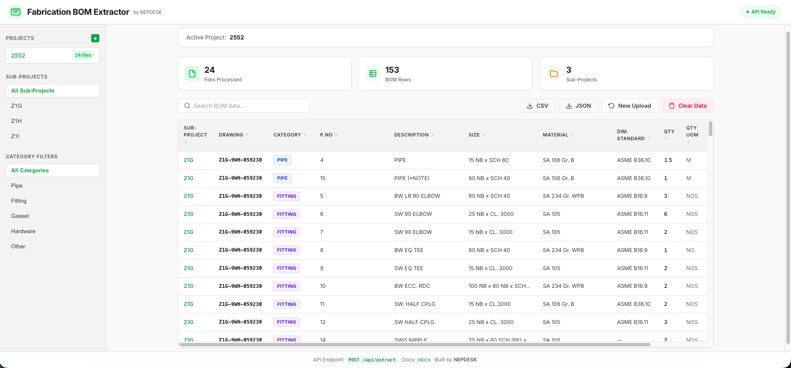

# Fabrication BOM API by NEPDESK

[](https://www.gnu.org/licenses/gpl-3.0)
[](https://nepdesk.com)



A high-performance, production-ready FastAPI microservice designed for heavy engineering, boiler, and piping fabrication workflows. It accepts bulk `.zip` uploads containing AutoCAD drawing files (`.dwg` or `.dxf`), converts `.dwg` files on the fly, parses them, and extracts structured Bill of Materials (BOM) data.

---

## Project Structure

The project has been refactored into a standard, modular, and production-ready FastAPI directory layout:

```
fabrication-bom-api/
├── LICENSE                 # GNU GPLv3 License
├── README.md               # Documentation
├── requirements.txt        # Production dependencies
├── .gitignore              # Git ignore rules
├── bom.db                  # SQLite database (generated at runtime, ignored by git)
├── app/
│   ├── __init__.py         # Package initialization
│   ├── main.py             # FastAPI App initialization & routing setup
│   ├── routers/
│   │   ├── __init__.py
│   │   ├── health.py       # Service health-check (/api/health)
│   │   ├── projects.py     # Projects CRUD (/api/projects)
│   │   └── bom.py          # BOM extraction and storage (/api/extract, /api/bom)
│   ├── models/
│   │   ├── __init__.py
│   │   ├── schemas.py      # Pydantic schemas (BOMItem, ProjectCreate, etc.)
│   │   └── database.py     # SQLite connections and DB operations
│   └── services/
│       ├── __init__.py
│       ├── extractor.py    # ezdxf BOM data parser engine
│       └── converter.py    # DWG → DXF on-the-fly converter
└── static/
    ├── index.html          # Dashboard frontend HTML
    ├── style.css           # Custom corporate styling (Green, Black, White)
    └── app.js              # Frontend UI script logic
```

---

## Quick Start

### 1. Prerequisites
Ensure you have Python 3.10+ installed on your system.
For `.dwg` to `.dxf` conversion, one of the following tools should be installed on your system path:
- **LibreDWG** (Preferred) - On macOS, install with: `brew install libredwg`
- **ODA File Converter** (CLI or ezdxf plugin wrapper)

### 2. Set Up Virtual Environment

```bash
# Clone the repository and navigate to it
cd fabrication-bom-api

# Create a virtual environment
python3 -m venv venv
source venv/bin/activate
```

### 3. Install Dependencies

```bash
pip install -r requirements.txt
```

### 4. Run the Server

```bash
uvicorn app.main:app --host 0.0.0.0 --port 5000 --reload
```

* **Frontend Web Dashboard**: [http://localhost:5000](http://localhost:5000)
* **Interactive OpenAPI Docs**: [http://localhost:5000/docs](http://localhost:5000/docs)

---

## API Documentation

### 1. Health Check
* **Endpoint**: `GET /api/health`
* **Response**:
```json
{
  "service": "Fabrication BOM API by NEPDESK",
  "version": "1.0.0",
  "docs": "/docs"
}
```

### 2. Extract BOM Data from ZIP
* **Endpoint**: `POST /api/extract`
* **Query Parameters**:
  - `project`: Name of the parent project (e.g. `Boiler-Unit-4`)
* **Request Body** (Multipart Form Data):
  - `file`: A `.zip` archive containing drawing directories.
* **Response (Consolidated JSON)**:
```json
{
  "status": "success",
  "total_files_processed": 1,
  "data": [
    {
      "sub_project": "Riser-Section",
      "drawing": "RISER-04",
      "category": "Pipe",
      "pno": "1",
      "description": "SEAMLESS STEEL PIPE",
      "size": "200 NB x SCH 80",
      "material": "SA106 Gr.B",
      "standard": "ASME B36.10",
      "qty": 3.6,
      "qty_unit": "M",
      "weight": 180.2,
      "weight_unit": "kgs"
    }
  ]
}
```

### 3. Retrieve Stored BOM
* **Endpoint**: `GET /api/bom`
* **Query Parameters**:
  - `project`: Project name to retrieve.

---

## License & Copyleft Protections

This project is licensed under the **GNU GPLv3** license.

Under the terms of the GNU General Public License v3, the unique extraction logic and source code contained in this repository:
- **Must remain open-source**: Any modified versions or derivative works must also be licensed under the GPLv3.
- **Cannot be commercialized in closed-source proprietary software**: Commercial redistribution of this software within closed, proprietary systems is strictly prohibited.
- See the [LICENSE](LICENSE) file for the full legal text of the license.
